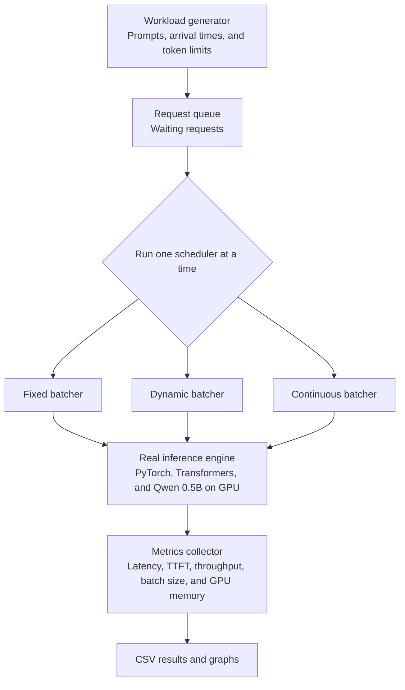

# Architecture plan

## Stack

| Part | Choice |
|---|---|
| Language | Python 3.11 |
| Model | `Qwen/Qwen2.5-0.5B-Instruct`, FP16 |
| Inference | PyTorch and Transformers |
| Output | CSV and Matplotlib graphs |
| Runtime | Docker Compose with NVIDIA GPU access |

The model has about 1 GB of FP16 weights. The benchmark has been validated on the target RTX GPU.

We will not use Ollama, LM Studio, or vLLM as the server. These tools control batching inside their engines. That would hide our batching code.

## Flow



The workload generator reads the dense or sparse JSONL file and sends real requests. It does not simulate model work. The Qwen model generates every output on the GPU.

There is no HTTP server and no `curl`. One command runs the complete experiment:

```bash
docker compose run --rm benchmark
```

The runner starts a clean process for each strategy. It runs dense and sparse workloads, repeats each strategy three times, and rotates the order between repetitions. The runs never overlap.

## Strategies

- Fixed takes `B` requests and runs the closed batch to the end.
- Dynamic takes up to `B` requests after a short wait, then runs the batch to the end.
- Continuous checks after each token and fills each free slot with a waiting request.

All runs use the same model, prompts, token limits, and GPU. Only the scheduler changes. Each graph uses the median of three runs and shows the run range as error bars.

## ORCA and vLLM

- ORCA gives us the main rule for continuous batching. Run one token step, remove finished requests, then add waiting requests.
- vLLM proves this design works in a real inference engine. We use it as a reference, not as the server for our three tests.
- We write our own small request queue, schedulers, timing code, and graphs. We do not copy their source code.

## Files and steps

```text
model.py        Shared token-step inference
schedulers.py   Three scheduling policies
run.py          Sequential runs and CSV output
plot.py         Graphs
```

First, run the scheduler tests. Next, run a two-request GPU smoke test. Then run the complete experiment and create the report graphs.

The first version recomputes full active sequences with `use_cache=False`. All strategies use this same path. A production KV-cache manager is outside the first version.

## Submission artifacts

The repository includes the Docker benchmark, both workloads, report source, measured graphs, and PDF report. Raw data for the reported run is committed under `docs/results/windows-rtx-5050-2026-10-10-wait50/`. Fresh runs remain under the ignored `results/` directory and can be reproduced with the Compose command.
