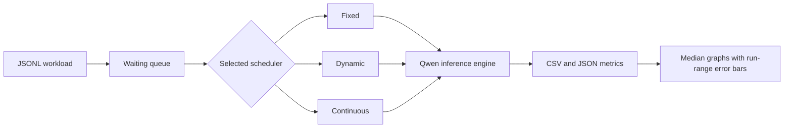

# Dynamic Batch Formation Simulator

## 1. Problem statement

This project implements fixed, dynamic, and continuous batching for real LLM inference inside Docker. It compares output-token throughput, request latency, time to first token (TTFT), and active batch size under dense and sparse request arrivals.

## 2. Architecture

The benchmark starts a clean process for one strategy at a time. Runs remain sequential. The order rotates between repetitions to reduce order bias.

## 3. Batching strategies

- **Fixed batching** waits for four requests, then runs that closed batch until every request finishes. The final batch may be smaller.
- **Dynamic batching** starts a closed batch when four requests are ready or the oldest waiting request has waited 50 ms.
- **Continuous batching** checks for free slots after every token step and admits waiting requests as active requests finish.

## 4. Technology stack

- Python 3.11
- PyTorch 2.8.0 with CUDA 12.8
- Transformers 4.46.3
- `Qwen/Qwen2.5-0.5B-Instruct` in FP16
- Docker Compose with NVIDIA GPU access
- Matplotlib 3.9.2

## 5. Experimental setup

The experiment ran on an NVIDIA GeForce RTX 5050 Laptop GPU with 8151 MiB of memory and driver 592.82, connected to AC power in High performance mode. Batch size was four and the dynamic wait limit was 50 ms. Each strategy ran three times per workload. Reported bars are medians; error bars span the minimum and maximum run. Raw results and device details are in `results/windows-rtx-5050-2026-10-10-wait50/`. The earlier 25 ms run is preserved separately.

The 50 ms limit was selected after an exploratory single-run sweep of 25, 50, 100, 200, and 400 ms on these workloads. This is tuning on the same benchmark, not an independent validation set. It improves the measured sparse comparison but does not establish a universal scheduler ranking.

Every strategy received the same prompt sequence and per-request `max_new_tokens` values. Each run completed 30 unique requests and generated 960 output tokens. This check prevents missing, duplicated, or unequal work from affecting the comparison.

## 6. Workloads and parameters

| Workload | Requests | Arrival interval | Output limits |
|---|---:|---:|---|
| Dense | 30 | 20 ms | 16, 32, and 48 tokens |
| Sparse | 30 | 400 ms | 16, 32, and 48 tokens |

The dense workload keeps requests available for batching. The sparse workload exposes the queueing cost of waiting for a full fixed batch.

Latency and TTFT are measured from scheduled arrival to completion and first token, respectively, so both include queueing. Throughput divides all 960 output tokens by the time from the first scheduled arrival to the last completion; the sparse result therefore includes intentional gaps between arrivals. Lower latency and TTFT are better; higher throughput is better. No scheduler is guaranteed to win every metric.

## 7. Results

### Dense workload

| Strategy | Tokens/s | Latency p50 (ms) | Latency p95 (ms) | TTFT p50 (ms) | TTFT p95 (ms) | Avg. active batch |
|---|---:|---:|---:|---:|---:|---:|
| Fixed | 111.89 | 3934.17 | 7387.23 | 3102.88 | 6557.84 | 2.50 |
| Dynamic | 113.84 | 4118.91 | 7310.49 | 3462.63 | 6759.23 | 2.50 |
| Continuous | 154.40 | 3082.77 | 5290.92 | 2150.59 | 4390.52 | 3.71 |

Continuous batching achieved the highest dense throughput and the lowest dense p50 and p95 latency. Its average active batch size of 3.71 shows that slot refilling kept more requests active. Dynamic throughput was close to fixed, but its median TTFT remained higher. Its 50 ms deadline starts the first batch with three requests, while fixed waits for four; because dynamic keeps that batch closed until completion, later requests can still queue behind it. In the first dense run, the first request's TTFT was 97 ms with dynamic versus 105 ms with fixed, but median queue wait rose to 3331 ms versus 3191 ms.

### Sparse workload

| Strategy | Tokens/s | Latency p50 (ms) | Latency p95 (ms) | TTFT p50 (ms) | TTFT p95 (ms) | Avg. active batch |
|---|---:|---:|---:|---:|---:|---:|
| Fixed | 73.91 | 1506.56 | 2184.72 | 586.26 | 1226.80 | 2.50 |
| Dynamic | 73.42 | 1256.70 | 1590.78 | 477.85 | 993.06 | 1.62 |
| Continuous | 75.94 | 736.47 | 1151.14 | 34.53 | 45.51 | 1.76 |

The continuous bars in the TTFT chart are 34.53 ms (p50) and 45.51 ms (p95), not zero. They look small because the same linear axis also shows fixed and dynamic values above 900 ms. TTFT ends at the first token; total request latency ends at the last token, so the corresponding continuous latency values are 736.47 ms and 1151.14 ms. Labels show medians of three runs and whiskers span the minimum to maximum run value.

Sparse throughput was similar because the arrival schedule dominated the makespan. At the tuned 50 ms limit, dynamic improved p50 latency by 17%, p95 latency by 27%, p50 TTFT by 18%, and p95 TTFT by 19% compared with fixed. Continuous batching admitted requests into free slots and achieved the lowest latency and TTFT.

## 8. Limitations and conclusion

This version performs real Qwen inference, but it recomputes active sequences on every token step with `use_cache=False`. It does not implement a production KV-cache manager, paged attention, or multi-GPU execution. Results apply to this model, hardware, workload, and parameter set.

The experiment demonstrates the intended trade-off without forcing one ranking. Fixed batching can collect larger closed batches, dynamic batching limits the initial wait but can build a later queue, and continuous batching uses iteration-level admission to improve utilization and responsiveness. On this setup, continuous batching performed best overall. Dynamic improved sparse latency at 50 ms but did not consistently beat fixed under dense arrivals. The archived 25 ms run shows why the wait limit matters.
