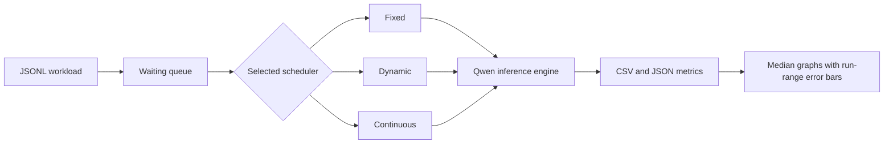
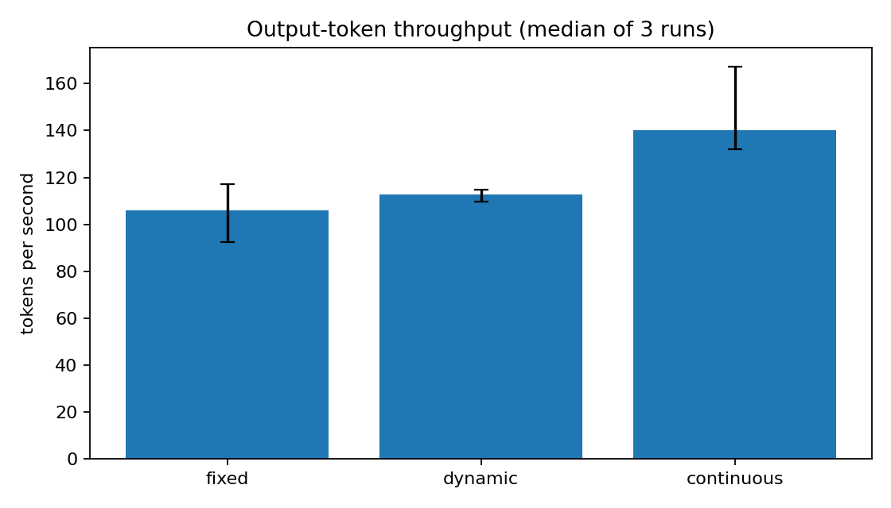
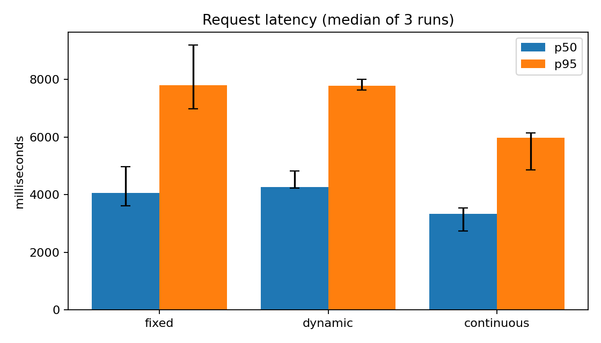
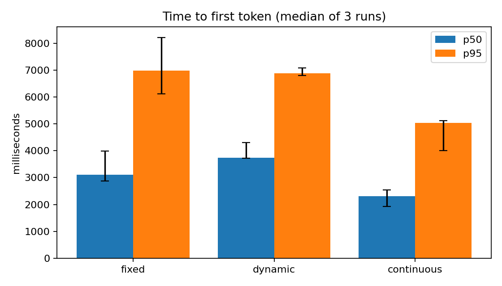
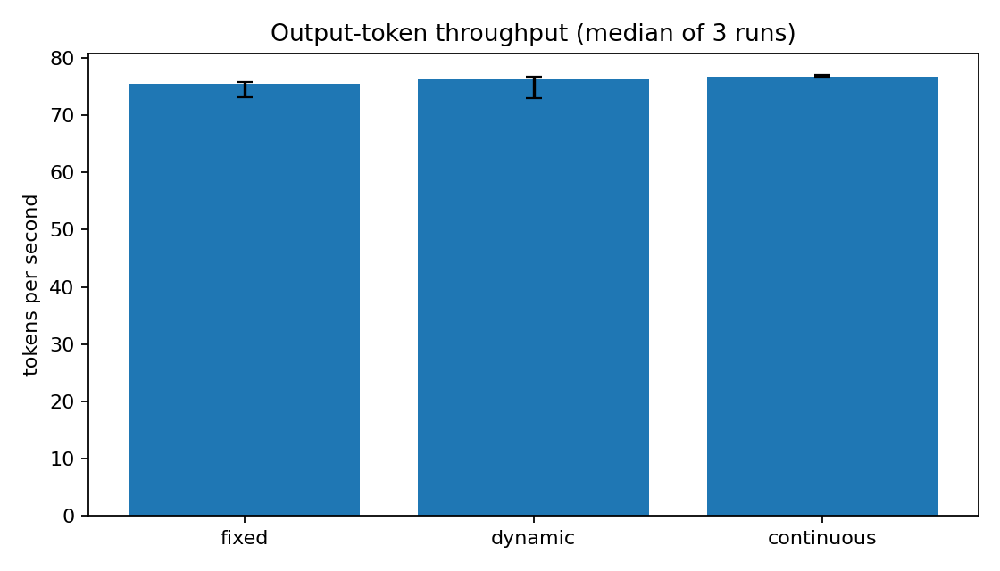
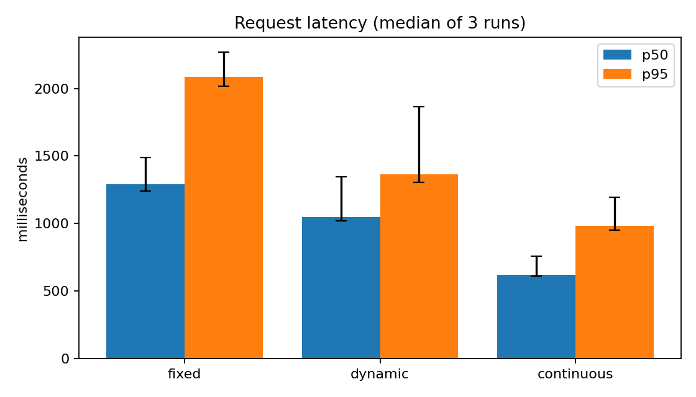
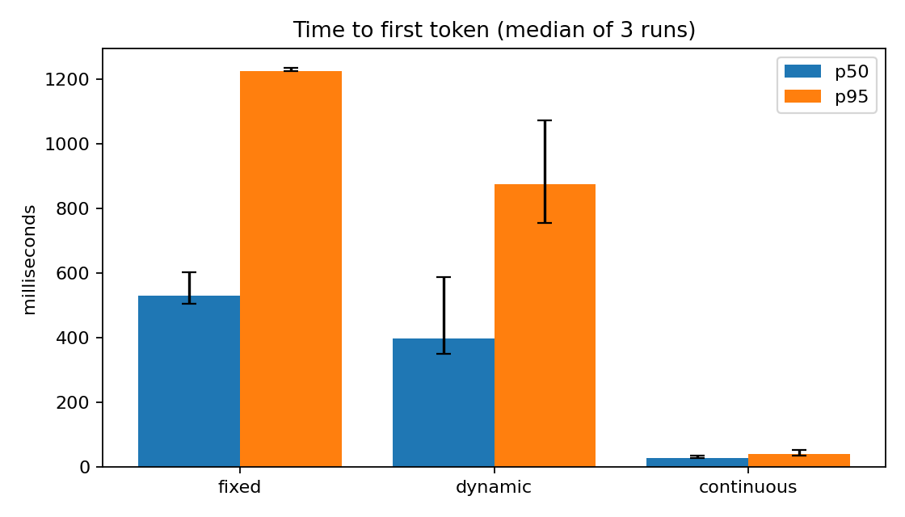
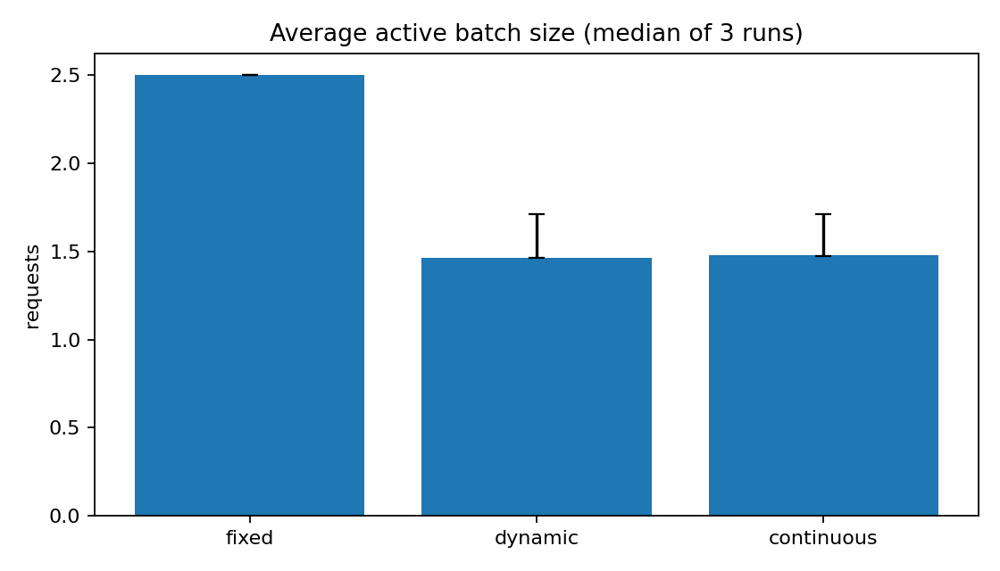

# Dynamic Batch Formation Simulator

## 1. Problem statement

This project implements fixed, dynamic, and continuous batching for real LLM inference inside Docker. It compares output-token throughput, request latency, time to first token (TTFT), and active batch size under dense and sparse request arrivals.

## 2. Architecture

The benchmark starts a clean process for one strategy at a time. Runs remain sequential. The order rotates between repetitions to reduce order bias.

## 3. Batching strategies

- **Fixed batching** waits for four requests, then runs that closed batch until every request finishes. The final batch may be smaller.
- **Dynamic batching** starts a closed batch when four requests are ready or the oldest waiting request has waited 25 ms.
- **Continuous batching** checks for free slots after every token step and admits waiting requests as active requests finish.

## 4. Technology stack

- Python 3.11
- PyTorch 2.8.0 with CUDA 12.8
- Transformers 4.46.3
- `Qwen/Qwen2.5-0.5B-Instruct` in FP16
- Docker Compose with NVIDIA GPU access
- Matplotlib 3.9.2

## 5. Experimental setup

The experiment ran on an NVIDIA GeForce RTX 5050 Laptop GPU with 8151 MiB of memory and driver 592.82. Batch size was four and the dynamic wait limit was 25 ms. Each strategy ran three times per workload. Reported bars are medians; error bars span the minimum and maximum run.

Every strategy received the same prompt sequence and per-request `max_new_tokens` values. Each run completed 30 unique requests and generated 960 output tokens. This check prevents missing, duplicated, or unequal work from affecting the comparison.

## 6. Workloads and parameters

| Workload | Requests | Arrival interval | Output limits |
|---|---:|---:|---|
| Dense | 30 | 20 ms | 16, 32, and 48 tokens |
| Sparse | 30 | 400 ms | 16, 32, and 48 tokens |

The dense workload keeps requests available for batching. The sparse workload exposes the queueing cost of waiting for a full fixed batch.

## 7. Results

### Dense workload

| Strategy | Tokens/s | Latency p50 (ms) | Latency p95 (ms) | TTFT p50 (ms) | TTFT p95 (ms) | Avg. active batch |
|---|---:|---:|---:|---:|---:|---:|
| Fixed | 106.04 | 4062.55 | 7806.35 | 3113.94 | 6973.02 | 2.50 |
| Dynamic | 112.58 | 4274.68 | 7780.91 | 3734.40 | 6879.27 | 2.61 |
| Continuous | 140.03 | 3329.73 | 5979.25 | 2316.10 | 5030.15 | 3.71 |

Continuous batching achieved the highest dense throughput and the lowest dense p50 and p95 latency. Its average active batch size of 3.71 shows that slot refilling kept the GPU busier. Dynamic throughput was slightly higher than fixed, while their latency ranges overlapped.

### Sparse workload

| Strategy | Tokens/s | Latency p50 (ms) | Latency p95 (ms) | TTFT p50 (ms) | TTFT p95 (ms) | Avg. active batch |
|---|---:|---:|---:|---:|---:|---:|
| Fixed | 75.42 | 1290.17 | 2084.15 | 528.78 | 1225.97 | 2.50 |
| Dynamic | 76.36 | 1048.23 | 1365.51 | 396.34 | 873.98 | 1.46 |
| Continuous | 76.75 | 619.02 | 984.31 | 28.16 | 39.55 | 1.48 |

Sparse throughput was similar because the arrival schedule dominated the makespan. Dynamic batching reduced p50 latency by 19% and p95 latency by 34% compared with fixed batching because it stopped waiting after 25 ms. Continuous batching reduced latency further by admitting each request as soon as a slot became available.

## 8. Limitations and conclusion

This version performs real Qwen inference, but it recomputes active sequences on every token step with `use_cache=False`. It does not implement a production KV-cache manager, paged attention, or multi-GPU execution. Results apply to this model, hardware, workload, and parameter set.

The experiment demonstrates the intended trade-off without forcing one ranking. Fixed batching can collect larger closed batches, dynamic batching avoids indefinite waits under sparse arrivals, and continuous batching uses iteration-level admission to improve utilization and responsiveness. On this setup, continuous batching performed best overall, while dynamic batching clearly improved sparse latency over fixed batching.
