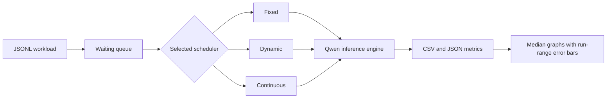

# Dynamic Batch Formation Simulator

**Experimental report**

**Team 16**

| Roll number | Team member |
|---|---|
| 241CS110 | Appaji Nagaraja Dheeraj, leader |
| 241CS145 | Rishinandan D R |
| 241CS214 | Ashlesh Prabhu |
| 241CS251 | Sachin Rohra |

**Mentor:** Balaji, balajink252is009@nitk.edu.in

## 1. Problem statement

This project implements fixed, dynamic, and continuous batching for real LLM inference inside Docker. It compares output-token throughput, request latency, time to first token, and active batch size under dense and sparse request arrivals.

## 2. Background

A GPU can process several input sequences in one tensor operation. Batching spreads model-weight reads and kernel-launch costs across those sequences, so the GPU usually does more useful work per step. Larger batches can improve throughput, but a server that waits too long to form a batch adds queueing delay.

Request-level scheduling chooses a batch and keeps it closed until every request in that batch finishes. Fixed and dynamic batching in this project use that rule. Requests with short outputs can leave capacity unused while longer requests continue.

ORCA introduced iteration-level scheduling for generative model serving [1]. The scheduler makes an admission decision between token-generation iterations instead of waiting for a whole batch to finish. Our continuous policy follows that core idea. After each token step, it removes completed requests and fills free slots from the waiting queue.

vLLM combines continuous batching with PagedAttention [2]. PagedAttention stores key-value cache blocks in non-contiguous GPU memory, which reduces waste and lets the engine manage more active sequences. This project does not use vLLM or copy its scheduler. It keeps one small inference engine so only the admission rule changes between tests.

## 3. Architecture



The benchmark starts a clean process for one strategy at a time. Runs remain sequential. The order rotates between repetitions to reduce order bias.

## 4. Batching strategies

- **Fixed batching** waits for four requests, then runs that closed batch until every request finishes. The final batch may be smaller.
- **Dynamic batching** starts a closed batch when four requests are ready or the oldest waiting request has waited 50 ms.
- **Continuous batching** checks for free slots after every token step and admits waiting requests as active requests finish.

## 5. Technology stack

- Python 3.11
- PyTorch 2.8.0 with CUDA 12.8
- Transformers 4.46.3
- `Qwen/Qwen2.5-0.5B-Instruct` in FP16
- Docker Compose with NVIDIA GPU access
- Matplotlib 3.9.2

## 6. Workflow

The complete experiment starts with:

```bash
docker compose run --rm benchmark
```

Docker Compose starts `python -m batch_bench.experiment` inside the benchmark container. `experiment.py` runs the dense workload and then the sparse workload. For each workload, it calls `run.py` with three repetitions.

`run.py` rotates the strategy order between repetitions and starts one child process for each strategy. The processes run sequentially, so two strategies never share the GPU. Each child loads and warms the same Qwen model, reads the same workload, creates one scheduling policy, and enters the shared scheduler loop.

The scheduler loop releases requests at their saved arrival times. It asks the selected policy which requests to admit, generates one token for every active request, records the step, removes completed requests, and repeats until no request remains. The run writes `requests.csv`, `steps.csv`, and `summary.json` under its strategy directory.

After all strategy processes finish, `plot.py` reads the three repetitions. It calculates medians and minimum-to-maximum error bars, then writes throughput, latency, TTFT, and active-batch figures. The copies embedded in this report come from the committed reported-run folder.

## 7. Experimental setup

The experiment ran on an NVIDIA GeForce RTX 5050 Laptop GPU with 8151 MiB of memory and driver 592.82, connected to AC power in High performance mode. Batch size was four and the dynamic wait limit was 50 ms. Each strategy ran three times per workload. Reported bars are medians; error bars span the minimum and maximum run. Raw results and device details are in `docs/results/windows-rtx-5050-2026-10-10-wait50/`. The earlier 25 ms run is preserved separately.

The 50 ms limit was selected after an exploratory single-run sweep of 25, 50, 100, 200, and 400 ms on these workloads. This is tuning on the same benchmark, not an independent validation set. It improves the measured sparse comparison but does not establish a universal scheduler ranking.

Every strategy received the same prompt sequence and per-request `max_new_tokens` values. Each run completed 30 unique requests and generated 960 output tokens. This check prevents missing, duplicated, or unequal work from affecting the comparison.

## 8. Workloads and measurements

| Workload | Requests | Arrival interval | Output limits |
|---|---:|---:|---|
| Dense | 30 | 20 ms | 16, 32, and 48 tokens |
| Sparse | 30 | 400 ms | 16, 32, and 48 tokens |

The dense workload keeps requests available for batching. The sparse workload exposes the queueing cost of waiting for a full fixed batch.

Latency and TTFT are measured from scheduled arrival to completion and first token, respectively, so both include queueing. Throughput divides all 960 output tokens by the time from the first scheduled arrival to the last completion. The sparse result therefore includes intentional gaps between arrivals. Lower latency and TTFT are better. Higher throughput is better. No scheduler is guaranteed to win every metric.

## 9. Results

### 9.1 Dense workload

| Strategy | Tokens/s | Latency p50 (ms) | Latency p95 (ms) | TTFT p50 (ms) | TTFT p95 (ms) | Avg. active batch |
|---|---:|---:|---:|---:|---:|---:|
| Fixed | 111.89 | 3934.17 | 7387.23 | 3102.88 | 6557.84 | 2.50 |
| Dynamic | 113.84 | 4118.91 | 7310.49 | 3462.63 | 6759.23 | 2.50 |
| Continuous | 154.40 | 3082.77 | 5290.92 | 2150.59 | 4390.52 | 3.71 |


Continuous batching achieved the highest dense throughput and the lowest dense p50 and p95 latency. Its average active batch size of 3.71 shows that slot refilling kept more requests active. Dynamic throughput was close to fixed, but its median TTFT remained higher. Its 50 ms deadline can start a batch before four requests arrive. Because dynamic keeps that batch closed until completion, later requests can still queue behind it.

### 9.2 Sparse workload

| Strategy | Tokens/s | Latency p50 (ms) | Latency p95 (ms) | TTFT p50 (ms) | TTFT p95 (ms) | Avg. active batch |
|---|---:|---:|---:|---:|---:|---:|
| Fixed | 73.91 | 1506.56 | 2184.72 | 586.26 | 1226.80 | 2.50 |
| Dynamic | 73.42 | 1256.70 | 1590.78 | 477.85 | 993.06 | 1.62 |
| Continuous | 75.94 | 736.47 | 1151.14 | 34.53 | 45.51 | 1.76 |


The continuous bars in the TTFT chart are 34.53 ms for p50 and 45.51 ms for p95, not zero. They look small because the same linear axis also shows fixed and dynamic values above 900 ms. TTFT ends at the first token. Total request latency ends at the last token, so the continuous latency values are 736.47 ms and 1151.14 ms. Labels show medians of three runs and whiskers span the minimum to maximum run value.


Sparse throughput was similar because the arrival schedule dominated the makespan. At the tuned 50 ms limit, dynamic improved p50 latency by 17%, p95 latency by 27%, p50 TTFT by 18%, and p95 TTFT by 19% compared with fixed. Continuous batching admitted requests into free slots and achieved the lowest latency and TTFT.

## 10. GPU memory

The table reports the median `peak_cuda_memory_bytes` value from three runs, converted to MiB. PyTorch records peak allocated CUDA memory after model warm-up.

| Workload | Fixed (MiB) | Dynamic (MiB) | Continuous (MiB) |
|---|---:|---:|---:|
| Dense | 993.29 | 993.29 | 1023.61 |
| Sparse | 993.29 | 982.44 | 990.95 |

Every measured peak stayed near 1 GiB. The benchmark therefore fits the assignment's 3 GB to 4 GB RTX target with room for the container runtime and driver allocations that this PyTorch metric does not count.

## 11. Limitations

The engine performs real Qwen inference, but it recomputes every active sequence on each token step with `use_cache=False`. It does not implement a production KV-cache manager, PagedAttention, or multi-GPU execution. Results apply to this model, hardware, workload, and parameter set.

Skipping the KV cache keeps this scheduler comparison fair because fixed, dynamic, and continuous batching all use the same inference path. No strategy gets a faster model implementation or a different memory policy. The cost is that every new token repeats attention work over tokens the model has already processed.

A KV cache would reuse the key and value tensors from earlier tokens. Absolute token-step time, latency, TTFT, and throughput would change. Cache storage would also raise GPU memory use and make memory allocation part of the scheduling problem. The gaps between strategies would probably change size because faster token steps reduce some queueing costs, while continuous admission may keep more cache blocks live at once. A paged cache could reduce that memory waste, but it would add another mechanism beyond the scheduling rule this experiment isolates.

## 12. Conclusion

The experiment shows the intended trade-off without forcing one ranking. Fixed batching can collect larger closed batches. Dynamic batching limits the initial wait but can build a later queue. Continuous batching uses iteration-level admission to improve GPU use and response time. On this setup, continuous batching performed best overall. Dynamic improved sparse latency at 50 ms but did not consistently beat fixed under dense arrivals. The archived 25 ms run shows why the wait limit matters.

## 13. References

1. Gyeong-In Yu et al. [ORCA: A Distributed Serving System for Transformer-Based Generative Models](https://www.usenix.org/conference/osdi22/presentation/yu). OSDI 2022.
2. vLLM project. [vLLM documentation](https://docs.vllm.ai/) and [source repository](https://github.com/vllm-project/vllm).
3. Qwen Team. [Qwen2.5-0.5B-Instruct model card](https://huggingface.co/Qwen/Qwen2.5-0.5B-Instruct).
4. Hugging Face. [Transformers documentation](https://huggingface.co/docs/transformers/index).
5. PyTorch. [PyTorch documentation](https://pytorch.org/docs/stable/index.html).
6. Docker. [Docker documentation](https://docs.docker.com/).
